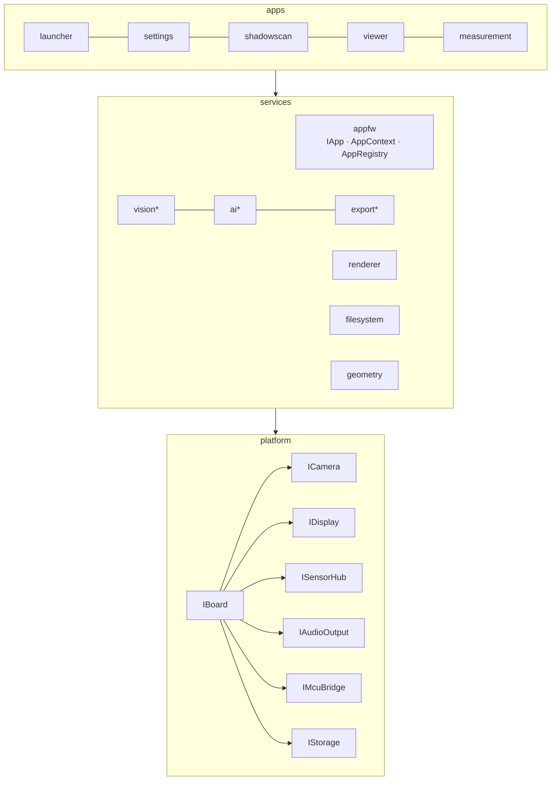
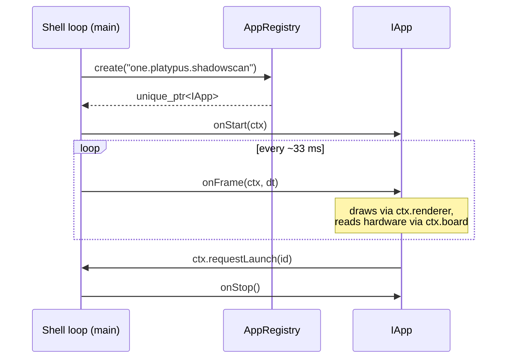

# PlatypusOS Architecture

## 1. Product model

PlatypusOS is an embedded operating environment for a commercial engineering
handheld (Platypus One) built on the Arduino UNO Q. The product is a *platform*:
every feature — 3D scanning (shadowscan), model viewing, measurement,
inspection, documentation capture, settings — is an application on a shared
runtime.

## 2. Target hardware

The Arduino UNO Q is a dual-brain board:

| Core | Role in PlatypusOS |
|---|---|
| Qualcomm QRB2210 (quad-A53, Linux) | Runs PlatypusOS proper: UI, vision, AI, storage |
| STM32U585 (Cortex-M33) | Real-time I/O: GPIO, PWM, ADC, deterministic sensor sampling |

The two communicate over an RPC transport abstracted by `IMcuBridge`
([IMcuBridge.hpp](../platform/hardware/include/platypus/hal/IMcuBridge.hpp)).
Nothing outside the bridge implementation knows the wire protocol.

## 3. Layering

\* skeleton directories, not yet implemented.

Rules:

1. **Strict downward dependencies.** An app may use services and HAL
   interfaces; a service may use HAL interfaces; the HAL depends on nothing.
2. **Interfaces at every boundary.** Concrete driver types appear only inside
   board implementations and the composition root.
3. **No global state.** The single composition root
   ([main.cpp](../apps/launcher/src/main.cpp)) constructs the object graph and
   injects it. The only static is the POSIX signal flag, which cannot be
   avoided.
4. **Independent compilation.** Every directory is a standalone CMake target;
   interface layers are header-only `INTERFACE` libraries.

## 4. The application model

- `AppContext` is the DI seam: `board`, `renderer`, `projects`, and a
  `requestLaunch` callback. Apps own nothing global.
- `AppManifest` declares identity and hardware requirements so the launcher can
  grey out apps whose hardware is absent.
- `AppFactory` (a plain function pointer) is deliberately ABI-simple: the same
  signature will be exported from dynamically loaded plugin `.so` files.

## 5. Hardware absence is normal

`IBoard` accessors return `nullptr` for missing capabilities. A Platypus One
without a camera still boots; apps declaring `requiresCamera` are simply not
launchable. This same mechanism supports future sensor expansion: new sensors
register self-describing `SensorDescriptor`s with `ISensorHub`, and generic UIs
render them without code changes.

## 6. Error handling

The HAL is exception-free across module boundaries: all fallible calls return
`Result<T>`/`Status` with a compact `Error` enum
([Result.hpp](../platform/hardware/include/platypus/hal/Result.hpp)). Services
may use exceptions internally but must not leak them into HAL callbacks.

## 7. Threading model

- The shell loop is single-threaded; all `IApp` callbacks run on it.
- Driver callbacks never invoke apps directly. Touch and button input enters the
  bounded `appfw::EventQueue`, then the shell dispatches a fixed snapshot on the
  UI thread each tick. Camera and sensor payload queues follow the same rule.
- Long computations (mesh reconstruction, AI inference) run on app-owned worker
  threads joined in `onStop()`.

## 8. Language split

- **C++20** — platform, services, app shells (deterministic, low-overhead).
- **Python 3.11+** — permitted in `services/ai` and `services/vision` behind a
  C++ interface boundary, for model prototyping on the Linux MPU. Production
  inference paths get ported to C++ once stable.
