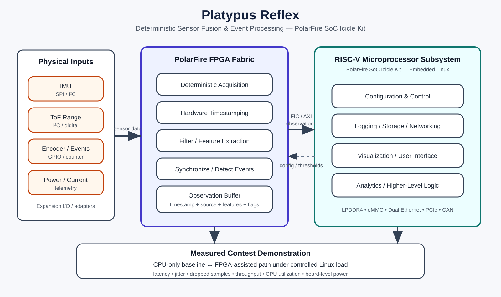

# PolarFire FPGA Design Contest 2026 — Platypus Reflex

**Track:** Track 2 — Connected Real-Time Systems Using PolarFire SoC Icicle Kit  
**Development platform:** PolarFire SoC Icicle Kit (MPFS250T)  
**Working title:** **Platypus Reflex — Deterministic Sensor Fusion and Event Processing on PolarFire SoC**

## Project Overview — form answer (226 words)

Platypus Reflex is a deterministic sensor-fusion and event-processing architecture for embedded engineering and robotic systems. Modern edge devices often combine sensors with different sample rates, interfaces, clocks, and latency requirements, then depend on a general-purpose operating system to acquire and synchronize them. Under CPU load, this can introduce timing jitter, dropped samples, and unpredictable response latency.

The proposed system uses the PolarFire SoC Icicle Kit to partition work between FPGA fabric and the RISC-V processor subsystem. The FPGA fabric will acquire and timestamp heterogeneous sensor inputs, perform configurable filtering and feature extraction, detect safety- or process-critical events, and place structured observations into a processor-accessible interface. The RISC-V cores will run embedded Linux for configuration, logging, visualization, networking, and higher-level analytics.

The initial demonstrator will use several complementary engineering sensors such as IMU, time-of-flight range, encoder/GPIO, and current/power monitoring. A CPU-only reference pipeline and an FPGA-accelerated pipeline will process the same workloads. Testing will measure end-to-end latency, latency jitter, dropped samples, CPU utilization, throughput, and power under increasing Linux system load.

The target applications are mobile engineering instruments, robotics, industrial monitoring, autonomous inspection, and other edge systems that need both rich software and deterministic physical-world interaction. The expected outcome is a reusable sensor-processing fabric that demonstrates where hardware acceleration meaningfully improves real-time behavior, while exposing clean, timestamped observations to Linux applications through the PolarFire SoC fabric-to-processor interfaces.

## Innovation & Expected Impact — form answer (228 words)

Platypus Reflex differs from a conventional FPGA sensor demo by treating programmable logic as a reusable “physical observation layer” between heterogeneous sensors and higher-level software. Instead of accelerating one fixed algorithm, the design will provide a configurable pipeline for deterministic acquisition, timestamping, filtering, feature extraction, event detection, and sensor synchronization before data reaches Linux.

The key innovation is the hardware/software partition. Time-critical work remains in PolarFire FPGA fabric while the RISC-V subsystem handles tasks that benefit from a full operating system: user interface, networking, storage, configuration, and analytics. PolarFire SoC Fabric Interface Controllers provide the bridge between these domains, allowing structured observations and events to move between fabric and processor memory.

The project will also quantify the value of this architecture rather than relying on a feature demonstration alone. Identical sensor workloads will be run through CPU-only and FPGA-assisted paths while Linux is subjected to controlled background load. The resulting comparison will characterize worst-case and average latency, jitter, sample loss, CPU utilization, throughput, and board-level power.

The broader impact is a reusable architecture for robotics, industrial monitoring, autonomous inspection, and portable engineering tools. Future sensor modules can change without redesigning the application layer: the FPGA fabric normalizes physical inputs into timestamped observations, while higher-level software consumes a consistent interface. The result is intended to be both a contest demonstrator and a transferable foundation for larger intelligent edge systems.

## Proposed benchmark

The design will compare the same sensor workload through two paths:

1. **CPU-only baseline:** sensor acquisition and processing in Linux software.
2. **FPGA-assisted path:** deterministic acquisition / preprocessing in programmable logic, with structured observations passed to the RISC-V subsystem.

Measurements:
- end-to-end event latency
- latency jitter
- sample loss / missed events
- CPU utilization
- sustained sensor throughput
- board-level power
- behavior under controlled Linux CPU / I/O / network load

No performance improvement is claimed before measurement; the contest result will report measured values and limitations.

## MVP sensor set

- IMU
- time-of-flight range sensor
- encoder / GPIO event source
- current or power telemetry
- optional additional digital sensor if schedule permits

The MVP deliberately avoids making camera processing a critical-path dependency. The Icicle Kit is being selected for its stronger connected real-time SoC architecture, FPGA capacity, Linux-capable RISC-V cluster, and fabric/processor integration.

## Development sequence

1. Icicle bring-up and reproducible Linux + Libero baseline.
2. One fabric-attached event source with hardware timestamping.
3. Fabric-to-MSS observation interface through a PolarFire SoC FIC.
4. Add filtering / feature extraction and multiple sensor sources.
5. Implement CPU-only reference pipeline.
6. Build automated latency, jitter, loss, utilization and power benchmark.
7. Add controlled Linux background-load scenarios.
8. Integrate physical demo, evidence capture, design paper and video.

## System Block Diagram

