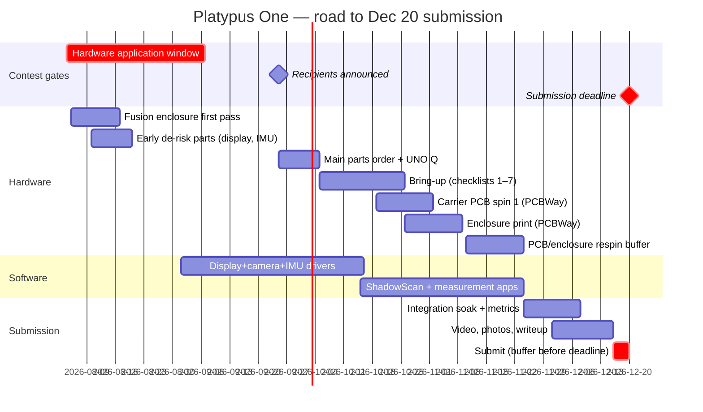

# Platypus One — Hardware Acquisition & Build Roadmap

Starting position (**2026-08-04**): zero hardware in hand. All dates anchored
to the AU 2027 contest timeline (see
[contest snapshot](../contest/autodesk-au2027-contest-snapshot.md)). Software
continues on the host simulator throughout, so hardware never blocks code.

## Phase 0 — NOW → Sep 7 (hardware application) 🔴 critical path

> **Deadline extended from Aug 23 to Sep 7, 2026.** Detailed working document
> with draft copy, BOM excerpt, and form answers:
> [HARDWARE_APPLICATION_CHECKLIST.md](../contest/HARDWARE_APPLICATION_CHECKLIST.md).

Goal: submit a strong free-hardware application (UNO Q 4G + $300 PCBWay + Fusion license).

- [ ] Create Hackster account; register as contest participant
- [ ] Start the Hackster project page: name, description, cover image
      (**original artwork** — the concept sheets in `docs/media/` are
      AI-generated references and must not stand in for original work)
- [ ] Install Autodesk Fusion (free personal license); model first-pass
      handheld enclosure around the UNO Q footprint and a **display envelope**
      — the panel is deliberately unfrozen per
      [ADR-0001](../adr/0001-dynamic-linked-prototype-display.md); export .f3d
- [ ] Publish the curated **Hardware Request BOM** from [the application checklist](../contest/HARDWARE_APPLICATION_CHECKLIST.md#4-bom-excerpt-for-the-project-page-agent) to the project page — must list the UNO Q and Fusion. Do not paste the master planning BOM or its received-research rows; see [BOM scope layers](BOM_SCOPE_LAYERS.md)
- [ ] Answer all application-form questions; submit via "Apply for hardware"
      tab **no later than Sep 4** (3-day margin)
- [x] Confirm on the live page whether the Sep 18 announcement date moved with
      the extension — ✅ verified 2026-08-30: **moved to Sep 25, 2026 5:00 PM
      PDT**. All Sep 18 anchors below are re-dated; bring-up now overlaps the
      Oct 19 PCB spin-1 order, so breadboard validation of carrier-PCB-relevant
      sensors must front-load into the first two weeks after parts arrive
- [ ] Optional de-risk buy (~$25): BNO055 IMU, so driver work can start on a
      spare SBC/dev board before the UNO Q arrives. The rev A display de-risk
      buy is **cancelled** — a linked prototype display is already in hand

## Phase 1 — Sep 8 → Sep 25 (waiting on announcement)

- [ ] Refine Fusion model: button placement, camera/ToF windows, battery bay
- [ ] Start Fusion **Electronics**: carrier-board schematic (I²C hub, buttons,
      power) — targets the Best Fusion Electronics Design prize
- [ ] Software: **linked-display driver** against the
      [presentation link](../protocols/presentation.md) (the panel is unfrozen,
      so no integrated-panel driver is written yet) + IMU ISensor driver
      written against interfaces; STM32 firmware for the MCU bridge protocol
- [ ] Draft the project story on Hackster as work happens (docs = 20 pts)

## Phase 2 — Sep 25 → mid-Oct (parts + bring-up)

Decision point Sep 25 (verified on the live page 2026-08-30; was Sep 18):
- **Selected:** hardware + credit incoming; reconcile the [Contest Core scope](../contest/PLATYPUSONE_CORE_SCOPE.md) against the master [BOM](BOM.md), then order only selected Core items the same week. Received-research rows R1–R4 are excluded unless explicitly promoted. Every ⚖ DECISION line must close first.
- **Not selected:** buy UNO Q retail (~$59) immediately; self-fund a reduced
  enclosure budget; scope unchanged otherwise.

- [ ] Execute [test checklists](TEST_CHECKLISTS.md) 1–2 (boot, PlatypusOS, MCU bridge)
- [ ] Checklists 3–7 as parts land (display, camera, sensors, power, audio)
- [ ] Breadboard-validate every sensor **before** freezing the carrier PCB

## Phase 3 — mid-Oct → mid-Nov (PCBWay + integration)

- [ ] Order carrier PCB spin 1 + enclosure from PCBWay (~2-week turn incl. shipping)
- [ ] Checklist 8–9 on arrival; log defects
- [ ] **Respin decision gate: Nov 10** — last date a second PCB/enclosure
      order safely lands before the freeze
- [ ] Apps: ShadowScan capture→mesh→export path; measurement app calibrated

## Phase 4 — mid-Nov → Dec 20 (freeze, document, submit)

- [ ] **Hardware freeze Nov 24** — after this, software and documentation only
- [ ] Checklist 10 integration soak; capture accuracy metrics
- [ ] Shoot submission video + photos (device in action, in hand)
- [ ] Final BOM reconciliation; schematics exported from Fusion; .f3d attached;
      code repo linked/licensed cleanly (cite all third-party licenses)
- [ ] **Submit Dec 16–18** — never the deadline day

## Standing risks

| Risk | Mitigation |
|---|---|
| Not selected for free hardware (announced Sep 25) | Budget reserves $430 self-fund path; scope trims pre-planned (FDM enclosure, drop haptics) |
| UNO Q display path harder than expected (SPI from Linux vs MCU) | Fall back to driving panel from STM32 side over the bridge; renderer already targets dumb-framebuffer present() |
| PCBWay turnaround eats December | Spin-1 order by Oct 19; respin gate Nov 10; enclosure printable locally as emergency fallback |
| Single point of failure: one UNO Q | Handle with care; no live rewiring; consider second board if budget allows after Sep 25 |
| Docs crunch at deadline | Write the Hackster story continuously from Phase 1 (it's also 50/100 rubric points) |
