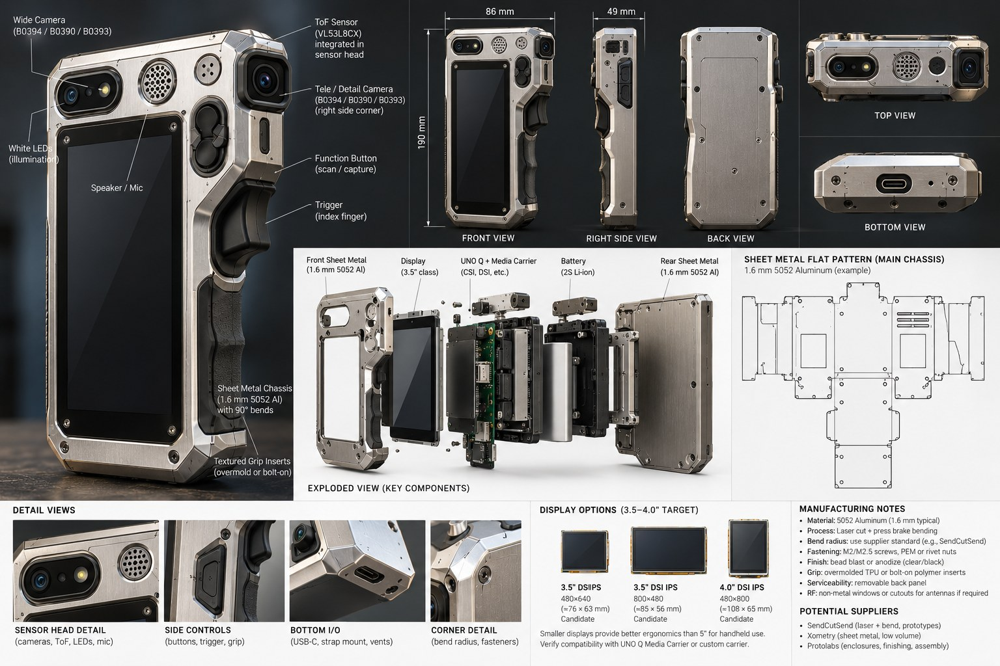

# Rev A-SM1 — folded sheet-metal instrument chassis: mechanical requirements

Input for the Fusion envelope study (#41). Direction from Matthew's Rev A-SM1
sketch (#41, 2026-10-04): a folded 5052 aluminium instrument chassis with
separate polymer parts, not a one-piece organic metal shell.

Status: **requirements for a bounding study, not released dimensions.** Every
number is tagged VENDOR (manufacturer data), PROVISIONAL (a target band to
study) or UNRESOLVED (unknown; must be measured or chosen). Nothing here is
bench evidence.

Fusion user parameters: [rev_a_sm1_parameters.csv](rev_a_sm1_parameters.csv),
importable with Fusion's Parameter I/O add-in (Name, Unit, Expression,
Comment). UNRESOLVED values are `0 mm`; fill them before the geometry that
uses them is trusted.

## Architecture

| # | Part | Material / process | Role |
|---|---|---|---|
| 1 | Main chassis | 5052-H32 aluminium, laser-cut flat + press-brake bends | shallow U-channel: display face + top sensor flange + rear/side return flanges; structure and heat spreader |
| 2 | Rear service cover | sheet or polymer | removable for service; carries **no** datum function |
| 3 | Grip | polymer, bolted to chassis | battery (in grip / lower spine), trigger |
| 4 | RF window / end cap | polymer | no metal across the UNO Q antenna region |
| 5 | Sensor datum bracket | rigid, removable (machined or thick formed part) | carries camera + ToF (+ later illumination) as one calibrated unit |
| 6 | Display retention | rails/clips on the chassis | parameterised for 3.5 / 4.0 / 4.3" envelopes |

Controls: trigger in the grip under the index finger; encoder near the thumb
at the top/side edge (left-hand implications in
[INDUSTRIAL_DESIGN.md](INDUSTRIAL_DESIGN.md)).

## Requirements

### R1 — sheet metal (vendor-governed)

- R1.1 Material 5052-H32, **1.2 mm PROVISIONAL**; the final gauge is the
  selected vendor's stocked thickness.
- R1.2 Bend radius, K-factor, relief size, minimum flange, hole-to-edge and
  hole-to-bend distances come **from the selected vendor's published table**
  for that material/thickness. The CSV carries placeholders only
  (R = t, K = 0.44) so the Fusion sheet-metal rule is set up, not released.
- R1.3 Bends are simple, open press-brake bends with tool access; no closed
  box sequences; every bend reachable after the previous one.
- R1.4 Bend reliefs at every flange intersection.
- R1.5 Hardware: PEM nuts/standoffs or rivnuts where accessible; tabs/slots
  only where they make assembly repeatable.
- R1.6 No exposed sharp sheet edge on a user-facing surface: hem it or cover
  it with the polymer bezel/grip.
- R1.7 The flat pattern must pass the chosen vendor's DFM check before any
  geometry is called released.

### R2 — envelope (PROVISIONAL bands)

- R2.1 Head/display body: 75–85 W × 125–145 H × 24–32 D mm before the grip.
- R2.2 Grip 35–45 mm thick, raked 10–15° rearward.
- R2.3 Balance and one-hand reach are evaluated on the printed mock-up, not
  assumed from these bands.

### R3 — display (swappable)

- R3.1 The front aperture, rails and retention are driven by `display_choice`
  and the `disp35_*` / `disp40_*` / `disp43_*` parameters, so 3.5, 4.0 and
  4.3" envelopes swap without rebuilding the chassis.
- R3.2 Portrait orientation: the 480×800 candidates are portrait-native and
  the head band is portrait-shaped (e.g. 4.0": 65.1 + 2 × 8 = 81.1 mm wide,
  inside R2.1).
- R3.3 Minimum sheet-metal edge around the aperture 8–12 mm until a panel's
  mechanics are fixed.
- R3.4 Module depth includes any driver board on the back (4.3inch DSI LCD:
  14.05 mm overall, VENDOR) plus the FFC exit and its bend.
- R3.5 Candidate ranking and the next panel to test:
  [DISPLAY_CANDIDATES_REV_A.md](DISPLAY_CANDIDATES_REV_A.md). The 5" bench
  panel is outside the product envelope.

### R4 — sensor datum bracket (calibration survives service)

- R4.1 Camera and ToF are mounted to **one rigid bracket**; their relative
  pose (the extrinsic calibration) is a property of the bracket, not of the
  enclosure.
- R4.2 The bracket locates on the chassis with a kinematic or 3-2-1 scheme
  (e.g. one face + two dowels/pins), so removal and refit return it to the
  same pose. Fasteners clamp; they do not locate.
- R4.3 Removing the rear service cover must not load, move or unfasten the
  bracket. The bracket fastens to the chassis, never to the cover.
- R4.4 Keep-out cones for the camera FOV (B0394 VENDOR 75° H × 60° V +
  margin) and the ToF FOV (from Platypus Lab evidence) are modelled bodies;
  no chassis, window frame or bezel intrudes.
- R4.5 Window material and distance in front of the ToF emitter/receiver
  follow the sensor vendor's cover-window guidance (crosstalk); recorded
  from the datasheet, then verified with Platypus Lab evidence.
- R4.6 The camera choice is still open (#40): the bracket keeps the board
  outline, lens stack and mounting holes as parameters until T5 measurements
  exist for the chosen module.
- R4.7 Space reserved on the bracket for controlled illumination (later), so
  adding it does not move the optical centres.

### R5 — compute, cables, RF, thermal

- R5.1 UNO Q (68.58 × 53.34 mm VENDOR) + Media Carrier stack height is
  UNRESOLVED: measure including connectors and FFC bends.
- R5.2 CSI and DSI FFC routes respect the cable's minimum bend radius
  (UNRESOLVED from the cable datasheet) and stay serviceable.
- R5.3 RF: locate the UNO Q antenna on the board; the RF window (part 4)
  covers it with a non-metallic clearance (UNRESOLVED margin).
- R5.4 Thermal: the chassis may act as a heat spreader for the UNO Q via a
  pad; decide after measuring operating temperature in the enclosure.

### R6 — power and controls

- R6.1 Battery in the grip/lower spine; dimensions UNRESOLVED (not selected).
- R6.2 Trigger travel and encoder clearance from the hand mock-up.

## Fusion study deliverables

1. Bounding bodies from the CSV: UNO Q + carrier, chosen camera (B0394
   first), ToF pod allowance, display envelopes for 3.5 / 4.0 / 4.3",
   battery allowance, trigger and encoder hand clearance.
2. Sheet-metal chassis with the placeholder rule, flat pattern exported.
3. Datum bracket as a separate component with its locating features.
4. A printed mock-up to judge grip size, screen usability, balance and
   service access before any cosmetic work.

## Gates before release

- [ ] Vendor and gauge selected; R1.2 values replaced from its table.
- [ ] Flat pattern passes the vendor's DFM check.
- [ ] Display chosen from the mock-up and its panel proven on the bench.
- [ ] Camera chosen (#40) and its T5 envelope measured.
- [ ] ToF pod dimensions and window guidance from Platypus Lab evidence.
- [ ] Bracket refit repeatability shown (remove/refit, recapture a fixed
      target, compare).
- [ ] RF window sized from the located antenna.

## Concept reference (2026-10-04) — ideas to evaluate, not requirements

Matthew shared a rendered concept board (front/side/back/top/bottom views,
exploded view, flat pattern, display options, manufacturing notes). It is
inspiration only; it contradicts itself in places and nothing in it is
measured or vendor-checked.

| Idea from the concept | Status here |
|---|---|
| Overall ~86 W × 190 H × 49 D mm, side grip integrated on the right edge with trigger and function button | Evaluate against R2 in the mock-up; 86 mm is just over the R2.1 width band, and the side-grip layout differs from the pistol grip in R2.2 |
| Front **and** rear sheet-metal panels (clamshell) around the internals | Alternative to the single U-channel + service cover; compare bend count, service access and datum independence (R4.3) |
| 1.6 mm 5052 called out | Study both 1.2 and 1.6 mm; the vendor table decides (R1.1) |
| Two cameras on the sensor head (wide + "tele/detail"), each labelled with all three SKUs | The Media Carrier has two CSI ports, so two cameras are electrically plausible; the roles depend on #40, and a second camera adds an extrinsic to calibrate (R4.1) |
| White LEDs beside the camera; speaker/mic grille on the head | Illumination space already reserved (R4.7); audio is optional per the core scope |
| 2S Li-ion battery | Battery not selected (R6.1); a 2S pack implies a regulator to the UNO Q input: a power-budget item for #33 |
| Bottom USB-C, strap mount, vents | Add to the mock-up; vents interact with R5.4 thermal |
| Display options 3.5" 480×640 (~76×63), 3.5" 800×480 (~85×56), 4.0" 480×800 (~108×65) | Only the 4.0" figure matches vendor data (4-DSI-TOUCH-A 108.30 × 65.10); the others are unsourced. The exploded view says "3.5-inch class" while the options run to 4.0" |
| Suppliers SendCutSend / Xometry / Protolabs; bead blast or anodise; PEM/rivnut M2/M2.5 | Consistent with R1; finish is a later choice |

## Linked projects (ownership unchanged)

- Platypus Lab owns the VL53L8CX/ToF experiment and its raw evidence; this
  document consumes its pod dimensions and FOV.
- ShadowScan Mobile owns the Pixel 4 planar-RGB corpus; shared scenes are
  useful for camera comparisons but it does not depend on this hardware.
- Mesh2CAD's design-intent concepts feed #37; #37 does not depend on ToF.
